---
tags:
  - task-state
  - agent-harness
  - langgraph-prep
status: active
updated: 2026-06-24
---

# Task State 工作流复盘

这份文档用于复盘当前项目里的手写 Task State / 可恢复任务型 Agent。它的目的不是替代代码，而是在进入 LangGraph 旁路迁移前，先把自己已经手写出来的状态机讲清楚。

当前实现是一个固定流程的论文答辩训练任务：

```text
retrieve_context
-> generate_question
-> wait_for_answer
-> evaluate_answer
-> rewrite_answer
-> generate_follow_up
-> wait_for_follow_up_answer
-> evaluate_follow_up_answer
-> summarize_training
```

对应核心文件：

```text
app/task_models.py       数据结构：DefenseTask / TaskStep
app/task_runner.py       节点顺序、下一步判断、输入继承
app/task_executor.py     自动节点执行逻辑
app/task_service.py      服务层：创建、启动、执行、提交、持久化
app/task_resume.py       恢复策略：执行当前步骤 / 等待人工输入 / 创建下一步
app/task_store.py        JSON 文件保存与加载
app/task_trace_analyzer.py 任务 trace 汇总
app/task_markdown_exporter.py Markdown 报告导出
```

## 一、核心数据结构

### DefenseTask

`DefenseTask` 表示一轮完整答辩训练任务。

关键字段：

```text
task_id          任务唯一 ID
topic            本轮训练方向
status           created / running / completed / failed
current_step_id  当前步骤 ID
steps            TaskStep 列表
metadata         任务级额外信息，例如错误信息
created_at       创建时间
updated_at       更新时间
```

它解决的问题是：一轮训练不是一次函数调用，而是一个可以暂停、恢复、审计的任务对象。

### TaskStep

`TaskStep` 表示任务中的一个节点。

关键字段：

```text
step_id       步骤唯一 ID
step_type     步骤类型，例如 retrieve_context
status        pending / running / completed / failed
input         当前步骤输入
output        当前步骤输出
evidence      检索证据或中间证据
tool_traces   工具调用轨迹
token_usage   token 使用量
cost_estimate 成本估算
error         错误信息
created_at    创建时间
updated_at    更新时间
```

它解决的问题是：每个节点都要独立记录输入、输出、证据、工具轨迹、耗时和错误，方便中断恢复与复盘。

## 二、节点与边

当前工作流是线性状态机，节点顺序定义在 `app/task_runner.py`：

```python
DEFENSE_TASK_STEP_ORDER = [
    "retrieve_context",
    "generate_question",
    "wait_for_answer",
    "evaluate_answer",
    "rewrite_answer",
    "generate_follow_up",
    "wait_for_follow_up_answer",
    "evaluate_follow_up_answer",
    "summarize_training",
]
```

边的规则很简单：

```text
只有当前 step.status == completed 时，才能创建下一步。
如果当前步骤还在 pending / running / failed，就不能越过它。
```

这对应 `get_next_step_type(task)`：

```text
没有 current_step -> 返回第一个节点 retrieve_context
当前步骤未完成 -> 返回 None
当前步骤已完成 -> 返回列表中的下一个节点
最后一个步骤已完成 -> 返回 None
```

## 三、状态流转图

```mermaid
flowchart TD
    A["create-task<br/>DefenseTask(status=created)"] --> B["start-task-step<br/>retrieve_context"]
    B --> C["execute-task-step<br/>retrieve_context completed"]
    C --> D["start-task-step<br/>generate_question"]
    D --> E["execute-task-step<br/>generate_question completed"]
    E --> F["start-task-step<br/>wait_for_answer"]
    F --> G["submit-task-answer<br/>wait_for_answer completed"]
    G --> H["start-task-step<br/>evaluate_answer"]
    H --> I["execute-task-step<br/>evaluate_answer completed"]
    I --> J["start-task-step<br/>rewrite_answer"]
    J --> K["execute-task-step<br/>rewrite_answer completed"]
    K --> L["start-task-step<br/>generate_follow_up"]
    L --> M["execute-task-step<br/>generate_follow_up completed"]
    M --> N["start-task-step<br/>wait_for_follow_up_answer"]
    N --> O["submit-follow-up-answer<br/>wait_for_follow_up_answer completed"]
    O --> P["start-task-step<br/>evaluate_follow_up_answer"]
    P --> Q["execute-task-step<br/>evaluate_follow_up_answer completed"]
    Q --> R["start-task-step<br/>summarize_training"]
    R --> S["execute-task-step<br/>summarize_training completed"]
    S --> T["DefenseTask(status=completed)"]
```



## 四、自动节点与人工节点

当前节点分两类。

自动执行节点定义在 `app/task_resume.py`：

```text
retrieve_context
generate_question
evaluate_answer
rewrite_answer
generate_follow_up
evaluate_follow_up_answer
summarize_training
```

这些节点可以通过：

```powershell
uv run python -m app.cli execute-task-step --task-id <TASK_ID>
```

人工输入节点：

```text
wait_for_answer
wait_for_follow_up_answer
```

它们不能自动执行，需要用户提交回答：

```powershell
uv run python -m app.cli submit-task-answer `
  --task-id <TASK_ID> `
  --answer "学生回答"

uv run python -m app.cli submit-follow-up-answer `
  --task-id <TASK_ID> `
  --answer "追问回答"
```

## 五、输入继承机制

`build_next_step_input(task, input)` 是当前任务流很关键的一点。

规则：

```text
1. 如果当前步骤已完成，把 current_step.output 复制给下一步 input。
2. 如果启动下一步时额外传了 input，则覆盖或补充这些字段。
```

这让后续节点天然继承前面信息。例如：

```text
generate_question 输出 question
wait_for_answer 输入里继承 question
submit-task-answer 输出 question + answer
evaluate_answer 输入里继承 question + answer
rewrite_answer 输入里继承 question + answer + evaluation
generate_follow_up 输入里继承 question + answer + evaluation + rewritten_answer
```

这就是状态机里的“状态传递”。

## 六、Resume 策略

`resume-task` 不直接修改任务，只回答“现在该怎么办”。

```powershell
uv run python -m app.cli resume-task --task-id <TASK_ID>
```

返回动作：

```text
completed                 任务已经完成
failed                    任务失败，需要人工检查
create_next_step          当前无步骤，或当前步骤已完成，可以创建下一步
execute_current_step      当前步骤是自动节点，可以执行
wait_for_human_input      当前步骤是人工节点，等待用户输入
manual_review             未知步骤类型，需要人工处理
failed_step               当前步骤失败，需要人工检查
```

这个设计的意义是：任务恢复不是盲目重跑，而是先根据当前状态给出下一步动作。

## 七、CLI 串联示例

完整流程可以手动一步一步跑：

```powershell
$out = uv run python -m app.cli create-task --topic "系统架构"
$taskId = (($out | Select-String '^TASK ID:').Line -replace '^TASK ID:\s*','')

uv run python -m app.cli start-task-step `
  --task-id $taskId `
  --input '{\"topic\":\"系统架构\"}'

uv run python -m app.cli execute-task-step --task-id $taskId

uv run python -m app.cli start-task-step --task-id $taskId --input '{}'
uv run python -m app.cli execute-task-step --task-id $taskId

uv run python -m app.cli start-task-step --task-id $taskId --input '{}'
uv run python -m app.cli submit-task-answer `
  --task-id $taskId `
  --answer "模块拆分可以让职责更清晰，也方便定位问题。"

uv run python -m app.cli start-task-step --task-id $taskId --input '{}'
uv run python -m app.cli execute-task-step --task-id $taskId

uv run python -m app.cli start-task-step --task-id $taskId --input '{}'
uv run python -m app.cli execute-task-step --task-id $taskId

uv run python -m app.cli start-task-step --task-id $taskId --input '{}'
uv run python -m app.cli execute-task-step --task-id $taskId

uv run python -m app.cli start-task-step --task-id $taskId --input '{}'
uv run python -m app.cli submit-follow-up-answer `
  --task-id $taskId `
  --answer "可以通过日志和模块边界先定位到特征处理或推理封装。"

uv run python -m app.cli start-task-step --task-id $taskId --input '{}'
uv run python -m app.cli execute-task-step --task-id $taskId

uv run python -m app.cli start-task-step --task-id $taskId --input '{}'
uv run python -m app.cli execute-task-step --task-id $taskId

uv run python -m app.cli analyze-task --task-id $taskId
uv run python -m app.cli export-task-markdown --task-id $taskId
```

注意：PowerShell 里 JSON 引号容易出问题。最稳的方式是：

```powershell
--input '{}'
```

如果需要传中文 JSON，可以先用变量：

```powershell
$inputJson = '{"topic":"系统架构"}'
uv run python -m app.cli start-task-step --task-id $taskId --input $inputJson
```

## 八、手写实现与 LangGraph 的对应关系

现在这套手写实现已经具备 LangGraph 的核心概念：

| 当前手写实现 | LangGraph 概念 |
| --- | --- |
| `DefenseTask` | Graph State |
| `TaskStep` | Node execution record |
| `DEFENSE_TASK_STEP_ORDER` | Edge / workflow topology |
| `execute_task_step()` | Node dispatcher |
| `execute_retrieve_context_step()` 等函数 | Node function |
| `wait_for_answer` | Human-in-the-loop interrupt |
| `task_store.py` | Checkpointer / persistence |
| `resume-task` | Resume / next action detection |
| `tool_traces` | Observability / trace |

所以后续迁移 LangGraph 时，不应该推倒重来，而是旁路复刻：

```text
app/langgraph_workflow/
```

迁移目标：

```text
同样的节点
同样的输入输出字段
同样的人工输入点
同样的任务恢复语义
```

不允许覆盖：

```text
app/task_executor.py
app/task_service.py
app/task_resume.py
app/agent.py
```

## 九、当前实现的优点

- 简单直观，适合学习状态机本质。
- 每个步骤输入输出都可落盘。
- 可恢复，任务中断后不会丢上下文。
- 自动节点和人工节点边界清楚。
- 易于测试，因为每个节点都支持 fake 函数注入。
- 可审计，任务 trace 能统计耗时、工具调用、证据、token 和 cost。

## 十、当前实现的局限

- 目前是线性流程，不支持条件分支。
- `start-task-step` 和 `execute-task-step` 仍需要用户手动串联，后续可以封装为 `run-task-until-blocked`。
- 失败后的 retry / rollback 策略还比较简单。
- 人工节点还不是框架级 interrupt，只是 CLI 提交。
- 多任务并发、锁、幂等性还没做。
- 还没有 LangGraph checkpointer 的对照实现。

## 十一、下一步学习目标

进入 LangGraph 之前，先完成两件事：

1. 画清楚当前 Task State 的状态图和字段流。
2. 用旁路目录复刻最小 LangGraph demo，不覆盖原代码。

建议下一步：

```text
新增 app/langgraph_workflow/，实现最小 graph-demo-task。
只复刻 retrieve_context -> generate_question -> wait_for_answer 这前三步。
确认 LangGraph 的 State / Node / Edge / interrupt 概念与当前手写实现能对应起来。
```
